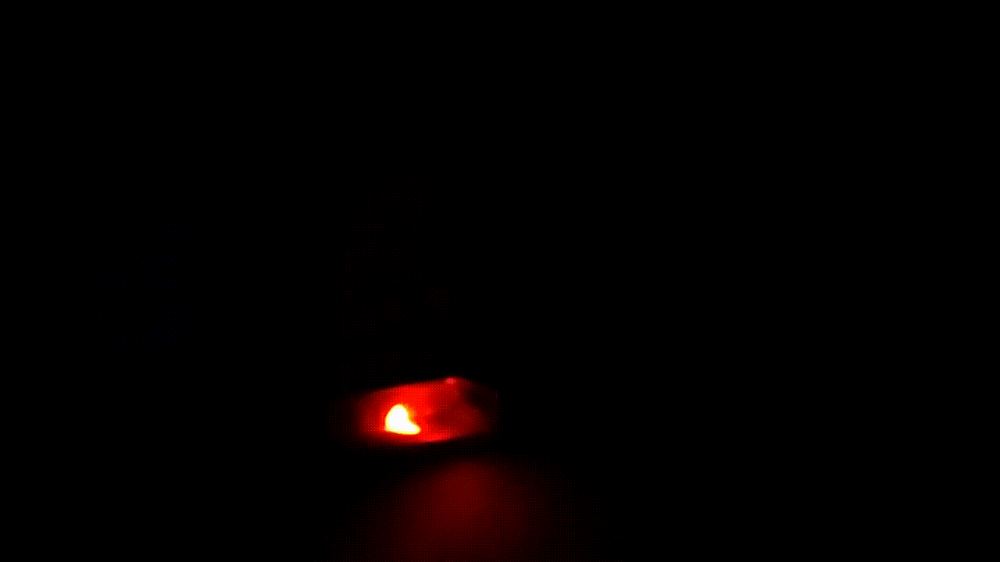

# arduino-mamiso-fake-alarm
A fake alarm based on arduino

This is how it looks like within an alarm's outside box.

## Features
Tries its best to work without knowing what the current time is. The idea is to follow how bright it is in order to identify night/day and based on predefined delays provide the essance of "armed" or "not armed" alarm.

## Dependencies

1. [FastLED](https://www.arduino.cc/reference/en/libraries/fastled/) in order to communicate with the addressable LED strip
2. Addressable RGB LED strip with 4 (four) leds, `WS2811`-mode based. Type can be changed through `LED_TYPE`  definiton. Note, it is not easy to change number of leds, as patterns are hardcoded for this number. However, they can be easilly improved to whatever new need may arise.
3. A photoresistor

Notes:

1. Apparently, an addressable LED strip is overkill to handle 4 leds. Needless to say RGB is even more overkill, as only Black (off) or White is used. The whole project was just an excuse to start playing with RGB led strip, so after buying one I decided to go with that approach. On the other hand, while an overkill, addressable led strip simplified A LOT final implementation.

## Implementation

1. Connect `D3` (set as `DATA_PIN` in source code) with data line of the RGB LED strip
2. Connect `A0` (set as `PHOTO_PIN` in source code) with the one end of photoresistor along a 100kΩ resistor towards ground. Connect the other end of the photoresistor with 5V.

(apparently a schematic will do a better job, todo)

## How sunlight is calculated
Sunlight identifiaction is extremmelly basic. It is based on a photoresitor and function [getLightValue](https://github.com/xtsimpouris/arduino-mamiso-fake-alarm/blob/main/arduino-mamiso-fake-alarm.ino#L352) is responsible to minimize fluctuation. Unfortunately, there is a lot of error noise while reading sunlight values. To make this value as robust as possible, function does the following every time:

1. We read 4 times from analog input and devide by 4 to keep "a mean value of current raw reading"
2. We calculate current new value as a weighted result of..
    1. 40% of current one, as read in previous step,
    2. 20% of previous value,
    3. 20% of the second value before,
    4. 10% of the third value before and
    5. 10% of fourth value before
3. Result is pushed in the history of values for next calculations and remove the "fourth value before" from history. We always keep 4 results from the past.

The above procedure forces result to be steady between readings while also removes fluctuation. It is expected for the sunlight to change really slowly as time passes.

## Patterns
A pattern is selected randomly from the following cases and stays the same for `PATTERN_KEEP_FOR` amount of time (2 hours).
All patterns are based on the `MAIN_DELAY` betwen frames, currently 900ms.

Pattern 01

Pattern 02

Pattern 03

Pattern 04

Pattern 05 - The most classic one

Pattern 06

Pattern 07

